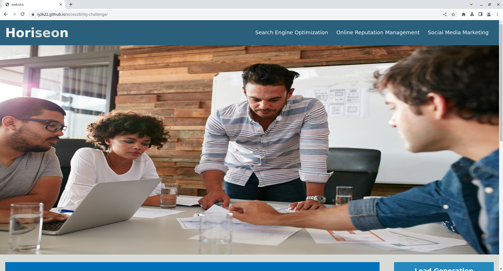
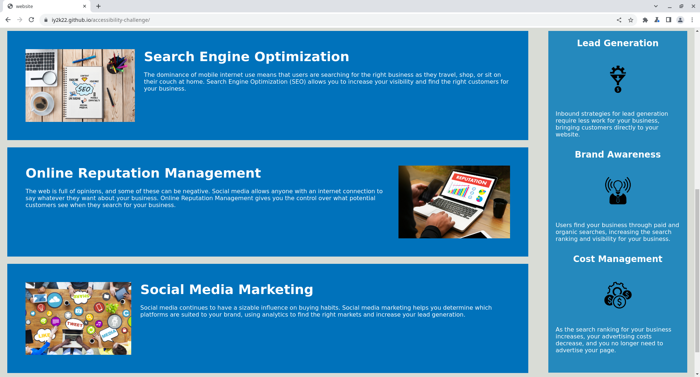

# Accessibility Challenge

My solution for the first week challenge on the edX front-end bootcamp.

## Usage
Simply open `index.html` in a web browser, or with the Live Server extension for Visual Studio Code.